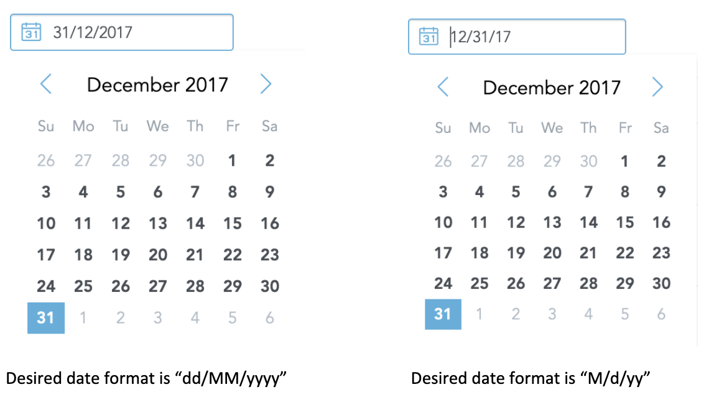

A **date picker** allows users to pick up a date.

By default, the selected date is displayed in `MM/dd/yyyy` format and one can pass a desired format to the component via "dateFormat" property.
The format can be any [value](https://date-fns.org/docs/format) supported by date-fns library.

A date can also be typed (in the desired format) using a keyboard as well.



## Structure

```jsx
import moment from "moment";
import "@gooddata/sdk-ui-kit/styles/css/main.css";
import { Datepicker } from "@gooddata/sdk-ui-kit";

<Datepicker
    date={moment("2017-12-31").toDate()}
    locale="en-US"
    dateFormat="dd/MM/yyyy"
    …
/>
```

## Properties

| Name | Required? | Type | Description |
| :--- | :--- | :--- | :--- |
| date | false | Date | Date value used to initialize date picker |
| className | false | string | Optional css applied to outer div |
| placeholder | false | string | The place holder if no date is selected |
| onChange | false | Function | Called when selected date changes |
| resetOnInvalidValue | false | boolean | Reset on invalid input |
| locale | false | string | The localization of the chart. Defaults to `en-US`. For other languages, see the [full list of available localizations](https://github.com/gooddata/gooddata-ui-sdk/blob/master/libs/sdk-ui/src/base/localization/Locale.ts). |
| dateFormat | false | string | Desired date format. Defaults to `MM/dd/yyyy` and can be any [format](https://date-fns.org/docs/format){:target="_blank" rel="noopener"} supported by date-fns library |
